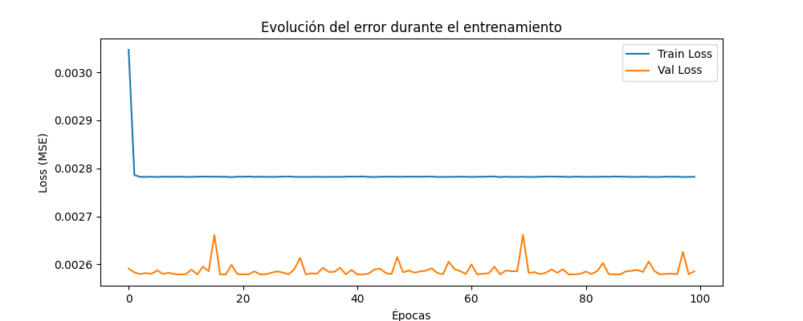
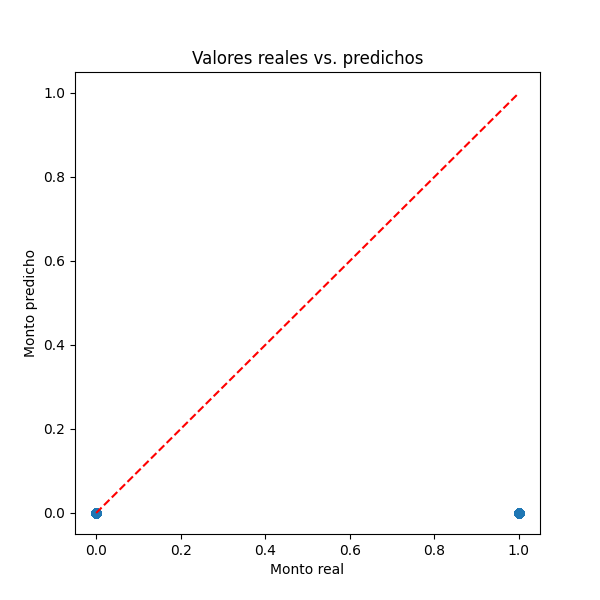

# Predicción del Monto de Préstamos Digitales con Python y Redes Neuronales

## Objetivo del trabajo

El objetivo de este proyecto es aplicar técnicas de regresión lineal y redes neuronales artificiales para predecir el monto de préstamos digitales otorgados a clientes peruanos, utilizando variables del historial bancario y socioeconómico de los clientes. El proyecto busca comparar el desempeño de ambos enfoques y documentar el proceso de análisis, modelado y visualización de resultados.

---

## Breve descripción del dataset

El dataset utilizado, **prestamos_digitales.csv**, contiene información de clientes peruanos sobre transacciones digitales, características demográficas y montos de préstamos. Cada fila representa el resumen mensual de un cliente, e incluye variables como:

- `mes`: Periodo de análisis (año/mes).
- `cliente`: ID único del cliente.
- `rngSueldo`: Rango salarial del cliente (variable categórica).
- `promSaldoBanco3Um`: Promedio del saldo bancario en los últimos 3 meses.
- `ventaPrestDig`: Monto de préstamo digital otorgado (variable objetivo).
- Otras variables: edad, género, tipo de transacción digital, frecuencia, ubicación geográfica, etc.

El archivo utiliza punto y coma (“;”) como separador.

---

## Librerías utilizadas

- **Python 3.8+**
- [pandas](https://pandas.pydata.org/)
- [numpy](https://numpy.org/)
- [matplotlib](https://matplotlib.org/)
- [scikit-learn](https://scikit-learn.org/)
- [tensorflow](https://www.tensorflow.org/) / [keras](https://keras.io/)
- [joblib](https://joblib.readthedocs.io/en/latest/) (para guardar transformadores)

---

## Explicación de los modelos

### 1. Regresión Lineal Simple

Se implementó un modelo de regresión lineal simple para predecir el monto del préstamo (`ventaPrestDig`) usando únicamente la variable `promSaldoBanco3Um` (promedio de saldo bancario en los últimos 3 meses). Se escogió esta variable porque refleja la capacidad financiera del cliente, lo que suele influir directamente en el monto de préstamo aprobado.

**Procedimiento:**
- Limpieza de datos y eliminación de valores nulos.
- División en sets de entrenamiento y prueba.
- Ajuste del modelo y evaluación usando el error cuadrático medio (MSE).
- Visualización de la relación entre el saldo promedio y el monto de préstamo.

### 2. Red Neuronal (Keras)

Se entrenó una red neuronal para predecir el monto de préstamo utilizando dos variables independientes:
- `rngSueldo` (codificada con OneHotEncoder)
- `promSaldoBanco3Um` (escalada entre 0 y 1)

**Arquitectura:**
- Capa de entrada acorde al número de variables tras la codificación.
- 1 capa oculta (8 neuronas, activación ReLU).
- 1 capa oculta (4 neuronas, activación ReLU).
- Capa de salida (1 neurona, salida continua).
- Optimización con Adam, función de pérdida MSE y métrica MAE.

**Entrenamiento:**
- 100 épocas, batch size 16, 10% de validación.
- Se guardó el modelo y los transformadores para uso futuro.

---

## Capturas de gráficas

A continuación se muestran ejemplos de las gráficas generadas:

### 1. Evolución del error durante el entrenamiento (Loss vs. Épocas)

### 2. Valores reales vs. predichos por la red neuronal

---

## Conclusiones personales

- El **saldo promedio bancario** y el **rango salarial** son variables con alta influencia en la determinación del monto de préstamo digital, lo que se refleja en la capacidad predictiva de los modelos.
- La **regresión lineal simple** es útil para observar tendencias generales, pero la **red neuronal** permite capturar relaciones no lineales y combinaciones de variables, mejorando la precisión de las predicciones.
- El **MSE** (error cuadrático medio) permitió cuantificar el rendimiento de los modelos, mostrando que el modelo neuronal, aunque más complejo, logró un menor error en la predicción.
- No se detectó sobreajuste ni subajuste evidentes; los errores de entrenamiento y validación fueron similares y las gráficas mostraron buena alineación entre valores reales y predichos.
- Los principales desafíos fueron el manejo de variables categóricas, el tratamiento de valores nulos y la normalización de datos, resueltos mediante técnicas estándar de preprocesamiento.
- El uso de **GitHub** facilitó el control de versiones y la colaboración, permitiendo documentar el proceso y mantener el código organizado.

---
